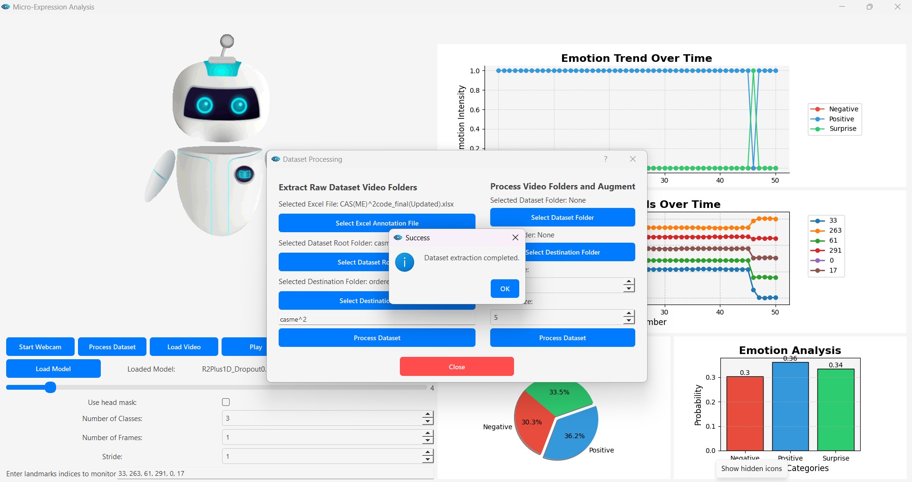
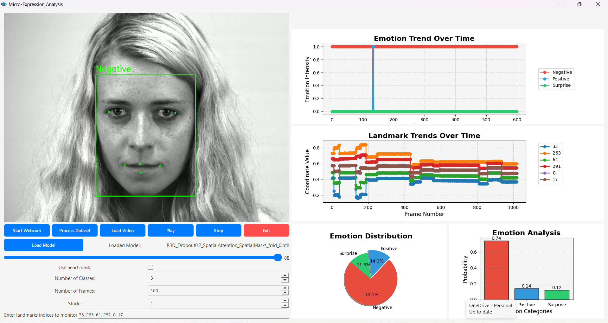

# 3D CNN Micro Expression Recognition Algorithm

This repository contains a 3D Convolutional Neural Network (3D CNN) implementation for **micro expression recognition**. The algorithm processes video datasets, performs recognition tasks, and offers both GUI and code-based methods for training and testing.

## 3-Class Composite Dataset

The model is trained and tested on a **3-class composite dataset** consisting of the following emotion classes:
- **Negative**
- **Positive**
- **Surprise**

The composite dataset is created by integrating data from the following micro-expression datasets:
1. **[SAMM (Spontaneous Micro-expression Database)](https://e-space.mmu.ac.uk/617069/)**  
   A dataset with high-resolution videos of micro-expressions captured under controlled lab conditions.
   
2. **[CASMEII (Chinese Academy of Sciences Micro-expression II)](http://casme.psych.ac.cn/)**  
   A well-known dataset containing spontaneous micro-expressions captured under strict illumination and experimental conditions.
   
3. **[CAS(ME)²](http://casme.psych.ac.cn/)**  
   A refined dataset for micro-expression analysis with annotations for macro- and micro-expressions.
   
4. **[CASME3](http://casme.psych.ac.cn/)**  
   An advanced dataset designed for analyzing micro-expressions with improved diversity and quality of videos.

These datasets provide a diverse set of micro-expressions, enabling the model to generalize effectively across different individuals and scenarios.

## Folder Structure

### `data_processing_gui/`
The `data_processing_gui` folder contains a **Graphical User Interface (GUI)** for processing video datasets and testing the micro expression recognition algorithm. The GUI allows users to:
- Process and preprocess video files into usable datasets.
- Dynamically select frames for training and evaluation.
- Test the algorithm on processed video datasets with ease.

This GUI simplifies the process of dataset management and testing, making it accessible for users without requiring direct coding.



### `training/`
The `training` folder contains the files necessary for training the 3D CNN model. It provides two ways to train the model:

1. **Using `train.py` (Local Python Script)**  
   - The `train.py` script allows users to train the model on their local machine or server.
   - This method provides full control over the training process and can be customized according to your hardware and dataset.
   
2. **Using Google Colab Notebook**  
   - Alternatively, you can use the provided **Google Colab notebook** for training the model in the cloud, eliminating the need for local setup.
   - The Colab notebook offers a cloud-based environment for training, monitoring the model's progress, and evaluating its performance.
   - This is the preferred method for users with limited hardware resources or those who prefer not to manage local environments.



## Requirements

Before running the code, ensure that the required dependencies are installed. You can install them by running:

```bash
pip install -r requirements.txt

## Citation
If you use this repository in your research or project, please cite it as follows:
Author: Phillip Takudzwa Chananda. "3DCNN Microexpression Recognition Algorithm". Version 1.0.0, 2024.
Available at: https://github.com/takuphilchan/Micro-Expression-Recognition.git

